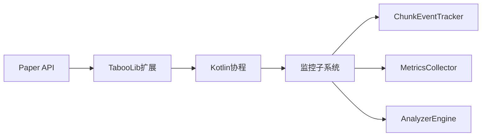

# 区块监控插件开发路线图

## 技术栈增强方案



## 阶段任务分解

### 阶段1：框架搭建（3天）

```kotlin
// 核心事件监听骨架
@TabooLibModule
class ChunkMonitorModule : PluginModule() {

    override fun onEnable() {
        // 事件总线注册
        registerListener<ChunkEventListener>()
        // 配置热加载
        bindConfig<ChunkConfig>()
    }
}

// 基础事件捕获
sealed class ChunkEvent {
    data class Load(val chunk: Chunk) : ChunkEvent()
    data class Unload(val chunk: Chunk) : ChunkEvent()
    data class Activity(val type: ActivityType) : ChunkEvent()
}
```

### 阶段2：数据采集（5天）

```kotlin
// 性能探针实现
class ChunkProbe {
    // 使用环形缓冲区存储采样数据
    private val buffer = CircularBuffer(1000)

    @Synchronized
    fun recordSample(sample: ChunkSample) {
        buffer.write(sample)
    }

    fun currentMetrics(): ChunkMetrics {
        return buffer.readAll().let { samples ->
            ChunkMetrics(
                tpsImpact = calculateTpsImpact(samples),
                activityScore = calculateActivityScore(samples)
            )
        }
    }
}
```

## 里程碑跟踪

| 里程碑    | 验收标准              | 技术风险点    |
|--------|-------------------|----------|
| 事件系统上线 | 支持10种以上区块事件类型     | 事件冲突处理   |
| 数据采集达标 | 99.9%事件捕获率，<2ms延迟 | 高并发写入性能  |
| 分析引擎就绪 | 实现EWMA算法，误差率<5%   | 数学模型精度验证 |
| 可视化完成  | 支持HUD+文字报告双模式     | 渲染性能优化   |

## 风险控制方案

1. **性能波动**：实现动态降级机制

```kotlin
enum class MonitorMode {
    FULL,    // 全量采集
    LIGHT,   // 基础指标
    SAFE     // 仅关键事件
}

val currentMode: MonitorMode
    get() = when (server.tps[0]) {
        in 0.0..15.0 -> MonitorMode.SAFE
        in 15.0..19.0 -> MonitorMode.LIGHT
        else -> MonitorMode.FULL
    }
```

2. **数据丢失**：采用WAL(Write-Ahead Logging)机制
3. **兼容性问题**：建立Paper版本白名单 