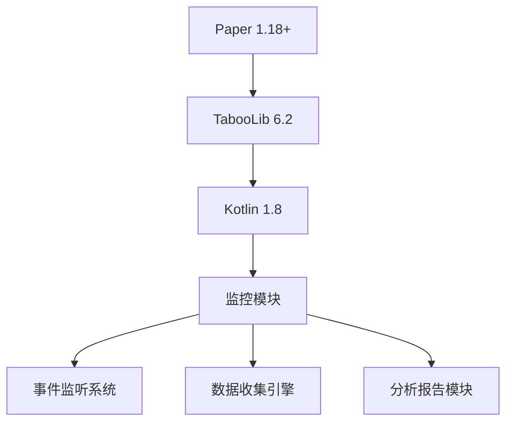

# 区块性能监控插件规划

## 技术架构



## 核心模块设计

### 1. 事件监听系统

```kotlin
// 区块活动追踪
sealed class ChunkActivity {
    data class RedstoneTrigger(val powerLevel: Int) : ChunkActivity()
    data class EntitySpawn(val entityType: EntityType) : ChunkActivity()
    data class BlockUpdate(val material: Material) : ChunkActivity()
}
```

### 2. 数据收集引擎

```kotlin
data class ChunkMetrics(
    val chunk: Chunk,
    val tpsImpact: Double,
    val activityCount: Map<Class<out ChunkActivity>, Int>,
    val loadDuration: Double
) {
    val riskLevel: RiskLevel by lazy {
        when (tpsImpact) {
            in 0.0..0.5 -> RiskLevel.LOW
            in 0.5..1.5 -> RiskLevel.MEDIUM
            else -> RiskLevel.HIGH
        }
    }
}
```

### 3. 分析引擎

```kotlin
class ChunkAnalyzer {
    // 使用指数加权移动平均算法
    private val decayFactor = 0.85

    fun calculateImpact(current: Double, previous: Double): Double {
        return previous * decayFactor + current * (1 - decayFactor)
    }
}
```

## 开发计划

| 阶段      | 周期 | 交付物               |
|---------|----|-------------------|
| 1. 框架搭建 | 3天 | 基础事件监听、TabooLib集成 |
| 2. 数据采集 | 5天 | 区块活动捕获、TPS关联分析    |
| 3. 分析模块 | 4天 | 负载系数算法、风险评级       |
| 4. 可视化  | 3天 | HUD显示、报告生成        |
| 5. 测试优化 | 5天 | 性能压测、算法调优         |

## 性能优化策略

1. **异步采样**：使用Kotlin协程分离数据收集和分析逻辑
2. **分片处理**：将区块监控任务分散到多个tick执行
3. **动态采样率**：

```kotlin
val samplingRate: Int
    get() = when (server.tps[0]) {
        in 0.0..15.0 -> 200  // 低TPS时降低采样
        in 15.0..19.0 -> 100
        else -> 50
    }
```

## 配置设计

```yaml
# 示例配置
monitoring:
  interval: 5s # 分析间隔
  sample-rate: 50 # 采样频率
  thresholds:
    high-risk: 1.2
    medium-risk: 0.7
  worlds:
    - world
    - world_nether
```

## 参考实现

1. [PaperMC TPS API](https://papermc.io/javadocs/paper/1.18/com/destroystokyo/paper/ServerTPS.html)
2. [BestViewDistance 性能优化策略](https://github.com/sofianedjerbi/BestViewDistance/wiki)
3. [Spark Profiler 采样算法](https://spark.lucko.me/docs/Profiling-How-To)